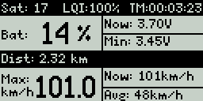
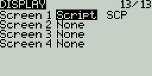
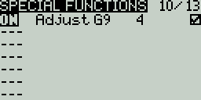

# EdgeTX Surface Cockpit Telemetry Screen

This project showcases a custom telemetry screen layout for a **EdgeTx** transmitter, for Black and White Screen with a Resulution of 128x64 Pixel, like the **Radiomaster** **Zorro**, **Pocket**, **GX12** or **MT12** or **Jumper Bumblebee** .
It shows real-time data from your model, such as battery status, speed, distance, and more, giving pilots a clear overview during a run.

## 📋 Display Elements

Below is a breakdown of the telemetry data visible on the screen:

| Label        | Description |
|--------------|-------------|
| **Sat: 26**  | Number of GPS satellites currently locked |
| **LQI: 100%**| Link Quality Indicator — shows signal quality between transmitter and receiver |
| **TM: 00:00:05** | Timer — tracks run duration (hh:mm:ss) |
| **Bat: 70%** | Battery level percentage |
| **Now: 3.70V** | Current battery voltage ("RxBt" used as Input) |
| **Min: 3.95V** | Minimum recorded battery voltage during the session |
| **Dist: 1.00 km** | Total distance traveled |
| **Max: 46.9 km/h** | Maximum speed achieved |
| **Now: 47 km/h** | Current speed |
| **Avg: 47 km/h** | Average speed |

## ✅ Features

- Suitable for surface models like cars or boats 
- Battery percentage calucation based on Lipo (4.2V) discharge curve
- Real-time GPS monitoring of speed, distance and Postion (only SD Card Log) 
- Logging on the SD Card active after the Screen is activated once ("/LOGS/scp_log_*.csv")

## 📦 Installation

To use this telemetry screen:

1. Clone or download this repository.
2. Transfer the telemetry script to your transmitter’s SD card.
3. Make sure that the "/LOGS/" folder exists. If not, create it
4. Set the Screen through the telemetry settings in the transmitter's model menu.\

5. Setup the Battery Cell Count by setting the Global Variable "G9" to the Number of Cells (RX Sensor reads 16.8V -> 4 Cells)\

6. Make sure GSpd, GPS, Sats, RQly, RxBt have been discovered within the telemetry menu/screen of opentx/edgetx
7. Restart the TX

## 🔧 Requirements

- OpenTX or EdgeTX firmware
- Display size of 128x64 Pixel
- Compatible telemetry sensors (Telemetry Values from: GSpd, GPS, Sats, RQly, RxBt)

## Credit 
- Battery Percent Calculation bases on work from JRWieland: https://github.com/jrwieland/Battery-mAh
- GPS Handling based on work from mosch: https://github.com/moschotto/OpenTX_GPS_Telemetry
- EdgeTX Telemetry Example https://github.com/EdgeTX

## License
License GPLv2: http://www.gnu.org/licenses/gpl-2.0.html
